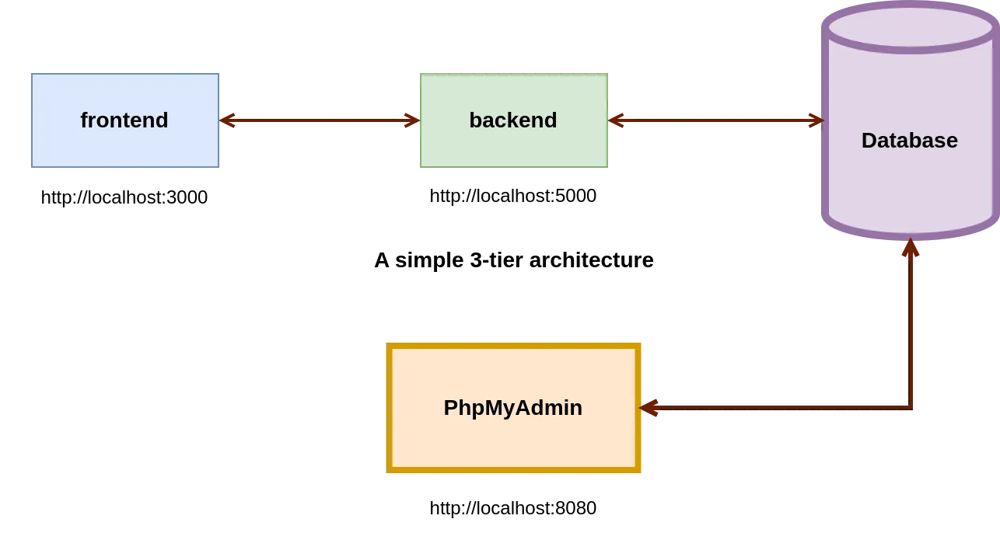
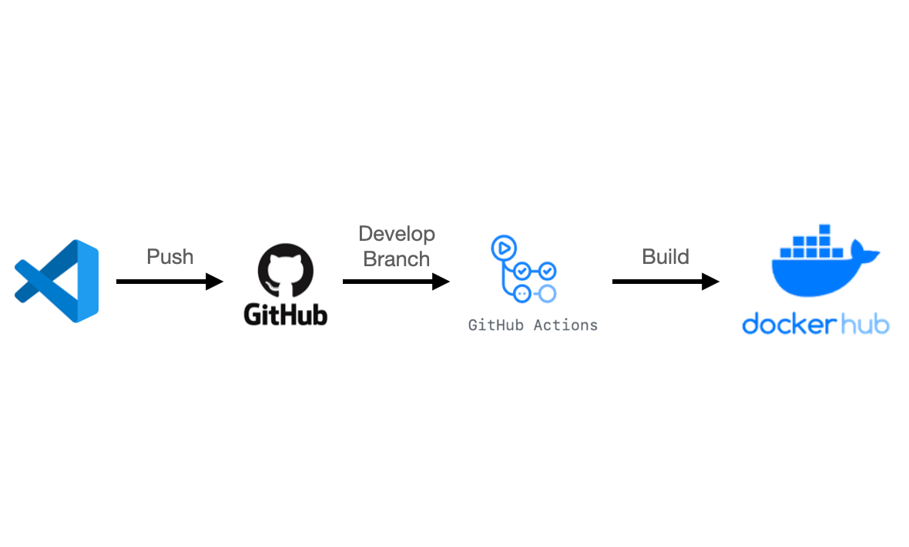

# Docker 3-Tier Project

## Description

This project demonstrates a 3-tier architecture using Docker to deploy a web application. The architecture consists of the following components:

- **Frontend**: A static web application served by an Apache server.
- **Backend**: A PHP API that interacts with the database.
- **Database**: A MySQL container for storing data.
- **PhpMyAdmin**: A web interface for managing the MySQL database.

This architecture allows for the separation of concerns and simplifies the management of different components of the application.

## Architecture

The following diagram illustrates the architecture of the Docker 3-Tier Project:



- The **frontend** interacts with the **backend** to fetch and display data.
- The **backend** handles the business logic and communicates with the **database** to retrieve and store data.
- **PhpMyAdmin** provides a convenient interface to manage the database.

## Project Structure

- **frontend**: Contains all the frontend code (HTML, CSS, JavaScript) and Apache configuration.
- **backend**: Contains all the backend code (PHP, API logic).
- **database**: Contains the SQL scripts for setting up the MySQL database.
- **phpmyadmin**: Configuration files for PhpMyAdmin.
- **docker**: Docker configuration files to set up the entire environment.

## Prerequisites

- Docker
- Docker Compose

## Setup Instructions

### Clone the Repository

```bash
git clone https://github.com/meriamebelaabdouli/Projet-Docker-3-Tiers.git
cd Projet-Docker-3-Tiers
```

### Start the Application

```bash
docker-compose up --build
```

### Access the Application
- **Frontend**: `http://localhost:3000`
- **Backend**: `http://localhost:5000`
- **PhpMyAdmin**: `http://localhost:8080`

## Continuous Integration and Continuous Deployment (CI/CD)



This project uses GitHub Actions for CI/CD. The pipeline automatically builds and deploys Docker images to Docker Hub whenever changes are pushed to the repository.

### How It Works:
- **GitHub Actions**: On every `push` or `pull request`, the pipeline triggers a build.
- **Docker Hub**: The built Docker images are tagged and pushed to the Docker Hub repository.

### Setup:
Ensure that your GitHub repository has `DOCKER_USERNAME` and `DOCKER_PASSWORD` secrets configured.
